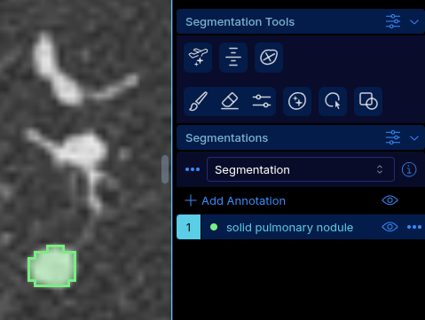
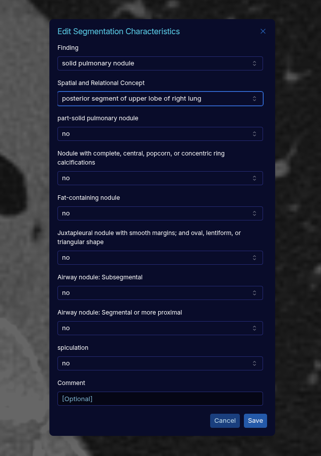

# OHIF DICOM Annotator

An [OHIF Viewer](https://ohif.org/) extension + mode that lets a reader draw segmentations and, for
each segment, answer a list of pre-defined questions. When the reader is done, the tool
produces **two DICOM objects**:

- a **DICOM SEG** (`Segmentation`) containing the labelmap;
- a **DICOM SR** (`Structured Report`) containing the answers, each one linked back to the segment
  it describes.

The questions, their allowed answers, their semantic codes (SCT / RadLex / a local scheme) and their
conditional display rules are entirely configurable: they live in the OHIF app config, so a new
annotation protocol can be deployed by editing a config file — no rebuild of the extension needed.

The app was built for annotation of a lung cancer screening image collection (CT nodule/cyst characterization), but the tool can be configured easily for other use-cases. It was deployed on the PARADIM platform (https://doi.org/10.1007/s10278-025-01554-y).

Developed and tested against **OHIF 3.11.1** (peer dependencies `^3.10.2`).

---

## What it does

- Replaces OHIF's stock segmentation panel with one that shows the patient name/ID (with copy
  buttons), the usual segmentation toolbox (brush, eraser, threshold, shapes, interpolation,
  bidirectional, etc.), and an enhanced segmentation table.
- New segmentations and segments start with the placeholder label `TODO`, so un-annotated segments
  are easy to spot.

  

- Clicking **Edit** on a segment opens a questionnaire dialog built from your configuration: one
  dropdown per question, an optional free-text comment, and questions that can conditionally
  show/hide based on previous answers. Re-opening a segment restores its previously saved answers.

  

- One designated question drives the segment's **label** and **color** automatically, so the same
  finding type always looks the same across readers and cases.
- The segmentation menu gains two actions:
  - **Complete Segmentation** — sends the SEG and SR to the connected PACS/server.
  - **Complete and Download** — saves both files locally.
- The mode restricts itself to studies that contain a CT series.

---

## The DICOM output

- The **SEG** contains the labelmap, with each segment's label and display color taken from the
  panel.
- The **SR** is a structured report (one measurement group per segment) that records the finding
  and every answered question, plus the free-text comment if one was entered. It references the
  matching segment in the SEG.
- If your OHIF deployment has an OIDC/SSO login configured, the logged-in user's name is recorded
  as the report's author; otherwise the report is stored anonymously (still valid DICOM).

---

## Configuration

Everything the reader is asked lives in your OHIF app config (e.g. `public/config/default.js` or
your deployed `app-config.js`). A working example is provided in
[`app-config.js`](app-config.js).

```js
window.config = {
  // ...
  institutionName: 'CRIUCPQ',            // recorded as the report's institution
  characteristicOptionsList: [ /* see below */ ],
};
```

### `characteristicOptionsList`

An ordered array of questions. Each entry:

| Field | Required | Description |
| --- | --- | --- |
| `ConceptNameCodeSequence` | yes | The question, as a coded concept: `{ value, schemeDesignator, meaning }`. `meaning` is what the reader sees. |
| `choices` | yes (non-empty) | The allowed answers, each `{ value, schemeDesignator, meaning, rbgValues? }`. |
| `isSegmentationLabel` | one question only | Marks the question whose answer becomes the segment's label and color. |
| `dependsOn` | no | Array of `[questionKey, answerKey]` pairs. The question is shown when **any** pair matches the current selection. |

Keys used by `dependsOn` are `"<schemeDesignator>-<value>"` — of the *question* for the first
element, of the *answer* for the second.

`rbgValues` is `[r, g, b]` in 0–255 and is only meaningful on the `isSegmentationLabel` question.

```js
characteristicOptionsList: [
  {
    isSegmentationLabel: true,
    ConceptNameCodeSequence: { value: '121071', schemeDesignator: 'SCT', meaning: 'Finding' },
    choices: [
      { value: 'RID50151', schemeDesignator: 'RadLex', meaning: 'solid pulmonary nodule',     rbgValues: [120, 240, 130] },
      { value: 'RID50153', schemeDesignator: 'RadLex', meaning: 'non-solid pulmonary nodule', rbgValues: [120, 230, 230] },
      { value: '107', schemeDesignator: 'ParadimLungScreening2025', meaning: 'atypical cyst', rbgValues: [230, 75, 50] },
    ],
  },
  {
    // Only asked when the Finding is a solid or non-solid pulmonary nodule.
    dependsOn: [
      ['SCT-121071', 'RadLex-RID50151'],
      ['SCT-121071', 'RadLex-RID50153'],
    ],
    ConceptNameCodeSequence: {
      value: 'RID50152', schemeDesignator: 'RadLex', meaning: 'part-solid pulmonary nodule',
    },
    choices: [
      { value: 'RID28475', schemeDesignator: 'RadLex', meaning: 'no' },
      { value: 'RID28474', schemeDesignator: 'RadLex', meaning: 'yes' },
      { value: '99', schemeDesignator: 'ParadimLungScreening2025', meaning: 'N/A' },
    ],
  },
]
```

A configuration is invalid (and will throw when the dialog opens) if any question has no choices,
or if no question is marked `isSegmentationLabel: true`.

Because the first choice of a visible question is auto-selected, **put your "not answered" / "N/A"
option first** if you want to be able to tell a deliberate answer from a default one — that is what
the example config does.

---

## Installation

The extension and the mode are consumed as local packages of an OHIF monorepo checkout.

```bash
# from the root of your OHIF Viewers checkout
git clone <this-repo> custom

yarn cli link-extension ./extensions/segmentation-workflow
yarn cli link-mode      ./modes/seg-workflow
```

This adds the two packages to `platform/app/pluginConfig.json`:

```jsonc
{
  "extensions": [
    // ...
    { "packageName": "segmentation-workflow", "version": "0.0.1" }
  ],
  "modes": [
    // ...
    { "packageName": "seg-workflow", "version": "0.0.1" }
  ]
}
```

Then run or build the viewer as usual (`yarn dev`, `yarn build`). In a Docker build, do the linking
after the sources are copied and before `build`:

```dockerfile
RUN bun cli link-extension ./extensions/segmentation-workflow
RUN bun cli link-mode ./modes/seg-workflow
RUN bun run build
```

Finally, make sure the config you serve defines `characteristicOptionsList` (and, optionally,
`institutionName` and `oidc`).

---

## Known limitations

- The mode and extension must stay siblings in the same checkout; they are not independently
  publishable as-is.
- Answers are not persisted across a page reload, and re-opening an already-stored SEG does not
  reload its SR answers into the panel — completing again produces new SEG/SR instances rather than
  updating the previous ones.
- The mode only applies to studies containing a CT series.
- The example coding scheme `ParadimLungScreening2025` is a local, non-registered designator used
  for concepts with no SCT/RadLex equivalent. Replace it with your own registered scheme if the
  data leaves your institution.
- Nothing enforces that every segment has been characterized before *Complete Segmentation*; a
  segment left at label `TODO` will be written to the SEG with no matching measurement group in the
  SR.

---
## How to cite

Please use the DOI associated with releases. Associated paper will be published shortly.

## License

MIT — see the `LICENSE` file in each package.

Author: Gabriel Couture.
